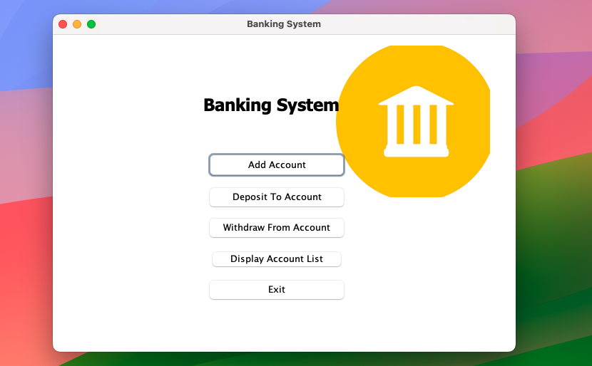

# Banking System - Java Swing Project

## Description
The Banking System is a Java Swing application that simulates basic banking operations. It provides a user-friendly interface for managing accounts, transactions, and other essential banking functions.

# Banking System - Java Swing Project

## Description
## Features
- Account creation and management
- Deposit and withdrawal transactions
- Balance inquiry
- Transaction history
- User-friendly GUI with Java Swing

Web & Simulator Integration
----------------------------
This repo now contains a minimal HTTP server and SQLite writer for simulation events.

Quick run (CSV output):

```bash
# compile all Java sources (ensure you're in repo root)
javac -d bin @sources.txt
java -cp bin simulator.SimulatorMain --transactions 100
```

Run simulator writing to SQLite (requires sqlite-jdbc JAR on classpath):

```bash
javac -d bin @sources.txt
# place sqlite-jdbc JAR in lib/sqlite-jdbc.jar
java -cp "bin;lib/sqlite-jdbc.jar" simulator.SimulatorMain --db simulation_output/sim.db
```

Start the lightweight web server (uses CSV or SQLite writer depending on system property):

```bash
javac -d bin @sources.txt
# start web server using CSV writer by default (no extra jars required)
java -cp bin web.WebServerMain
```

API
---
- POST /events  (JSON body) — accept a transaction event
- POST /simulate/start — starts an embedded simulator run in background

Notes
-----
- For production or remote ETL, run a proper web framework (Spring Boot) and Postgres; this lightweight server is for development and testing.
- To enable SQLite DB access you must add the sqlite JDBC driver JAR to `lib/` and include it on the classpath when running.


## Screenshots



## Technologies Used
- Java
- Java Swing for GUI
1. Clone the repository:
   ```bash
   git clone https://github.com/your-username/banking-system.git
   cd banking-system
   
   ```
2. Run Project
   ```bash
   javac Main.java
   java Main
   ```
## Usage
1. Launch the application.
2. Follow the on-screen instructions to perform banking operations.

## Contribution
Contributions are welcome! If you'd like to contribute to the project, please follow these steps:

1. Fork the repository
2. Create a new branch (git checkout -b feature/new-feature)
3. Commit your changes (git commit -m 'Add new feature')
4. Push to the branch (git push origin feature/new-feature)
5. Create a pull request

## License
This project is licensed under the MIT License - see the LICENSE file for details.

## Acknowledgments
- Thanks to Java for the programming language.
- Special thanks to Java Swing for the GUI components.
- Feel free to customize the content according to your project's specific details. Add more sections or information as needed.

Web Demo
--------
You can run the new backend and frontend locally using Docker Compose.

1. Build and start services:

```bash
docker compose up --build
```

2. Backend health: `http://localhost:8080/health`
3. Frontend UI: `http://localhost:3000` (calls backend at `http://localhost:8080`)

Dashboard workflows
-------------------
- Create checking or savings accounts from the Accounts panel.
- Select an account, enter an amount, and use Deposit or Withdraw.
- Review recorded activity in the ledger table.
- Configure transaction count and delays in Simulator, then start a run. Account balances and activity refresh automatically.

To stop the services:

```bash
docker compose down
```

